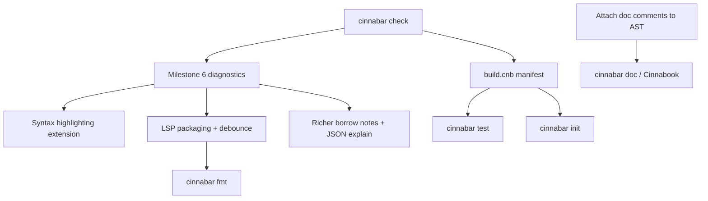

# Cinnabar Tooling Strategy

Planning document for developer tooling around the Cinnabar programming language. The language spec is [`MANIFESTO.md`](../MANIFESTO.md); the compiler architecture is [`ARCHITECTURE.md`](../ARCHITECTURE.md); the product roadmap is [`ROADMAP.md`](../ROADMAP.md).

---

## Design principle

Cinnabar's tooling should **surface facts the compiler already computed**, not re-derive them. The pipeline attaches symbol ids (resolver), type keys (typechecker), field offsets and variant tags (typechecker), and linearity flags (typechecker, read by borrow/codegen). Every tool — CLI flags, LSP, doc generator — must consume those attachments via `src/lib.rs` and obey the Single-Fact Rule from [`AGENTS.md`](../AGENTS.md).

Most languages need tooling to paper over implicit behavior (lifetimes, coercions, configurable lints). Cinnabar's opportunity is the opposite: make explicit semantics visible — linear consumption paths, borrow origins, tail-call eligibility, `impure` boundaries, unhandled `Result`/`Option`.

---

## Current state

### Implemented

| Tool | Location | What it does |
|------|----------|--------------|
| **`cinnabar` CLI** | `src/main.rs` | Compile, `-o`, `--run`, `-O`, `--dump-ast` |
| **`--dump-typed-ast`** | `src/inspect.rs` | Full front-end, then serialized arena with attachments |
| **`--print-layout`** | `src/codegen/layout.rs` | ABI sizes/alignments/offsets via same LLVM lowering as codegen |
| **`--emit-llvm` / `--emit-obj`** | `src/codegen/mod.rs` | Stop after IR or object emission |
| **`--explain-borrow`** | `src/borrow.rs` + `src/ast.rs` (`Note`) | Secondary labels on borrow/linearity errors |
| **`cinnabar::analysis`** | `src/analysis.rs` | Hover, go-to-def, references, completion, signature help over attached facts; unsaved-buffer overlay |
| **`cinnabar-lsp`** | `src/bin/cinnabar_lsp.rs` | Diagnostics and attached-facts queries; debounced single-flight analysis, stale-result suppression, multi-root graph reconciliation, borrow code lenses |
| **Structured diagnostics** | `src/emit_json.rs` | The `cinnabar.diagnostics.v1` envelope: every stage's diagnostics with their checker-produced explanations, real source spans, and LSP-style positions. `--explain-borrow=json` is the older spelling of the same request |
| **`--emit-json`** | `src/emit_json.rs`, `src/inspect.rs`, `src/codegen/layout.rs` | One JSON document per invocation: the parse-only or fully attributed arena, the layout report, or the diagnostic envelope |
| **VS Code / Cursor package** | `editors/vscode/` | Launches `cinnabar-lsp`, registers `.cnb`, language configuration, and the canonical TextMate grammar |
| **`cinnabar fmt`** | `src/format.rs` | Canonical, idempotent indentation and blank-line formatting; `--check` mode for automation |
| **Documentation pipeline** | `src/lexer.rs`, `src/parser.rs`, `src/docs.rs` | Attached doc facts, public API HTML, and version-pinned Cinnabook server |
| **Project commands** | `src/project.rs`, `src/main.rs` | `build.cnb` discovery plus `build`, `run`, `check`, `test`, and `init` |
| **Diagnostic snapshots** | `src/project.rs` | `.reject.cnb` discovery, exact `.stderr` snapshots, and `.exit` status expectations |
| **Fixture harness** | `pre_commit_check.sh`, `tests/repro_harness.rs` | Positive/negative compile-and-run tests |
| **Property fuzzer** | `tests/fuzz_generalization.rs` | Random well-typed programs + linearity rejection corpus |

### Not yet implemented

- Milestone 6 structurally attached suggestion engine and code actions
- Incremental compiler pipeline reuse in the LSP (edits are debounced and coalesced, but each accepted generation still runs the full pipeline)
- Additional cross-target backends and runtimes beyond the implemented host target driver

### End-to-end verification

All capabilities described as **implemented**, **done**, **delivered**, or **complete** in this
document are exercised through the real CLI, compiler pipeline, LSP stdio protocol, or local HTTP
servers. The verification matrix and evidence are recorded in
[`TOOLING-UAT.md`](TOOLING-UAT.md). The latest required repository gate passed on 2026-08-11,
including the complete Cargo suite and CLI fixture suite; the VS Code / Cursor extension also
passes `npm pack --dry-run`.

This verification does not relabel roadmap work as delivered. Structurally attached suggestions,
incremental LSP pipeline reuse, additional target backends/runtimes, sanitizer-gate expansion, and
the mechanized progress/preservation proof remain explicitly deferred where this document says so.

---

## Already on the roadmap (high leverage)

These unlock everything else and are tracked in [`ROADMAP.md`](../ROADMAP.md):

| Tool | Milestone | Why it matters |
|------|-----------|----------------|
| **`cinnabar check`** | 5 — delivered | Dedicated feedback without LLVM/clang; natural default for IDE save hooks |
| **`build.cnb` + `build`/`run`/`test`** | 5 — delivered | Project roots, entry points, recursive test discovery, rejection snapshots, and expected exit statuses |
| **Rich diagnostics + suggestions** | 6 — diagnostics delivered, suggestions pending | Multi-label Ariadne notes are implemented; structurally attached suggestions and code actions remain future work |
| **Cinnabook + Mushlings** | 8 — delivered early | Docs server plus exercises sourced from real compiler errors |
| **Sanitizer gate** | 7 | ASan/UBSan/Valgrind over all fixtures — verification tooling for the Crucible Rule |

---

## Tier 1 — Extend the attached-facts stack (COMPLETE)

Tier 1 is complete. Every language-aware answer comes from resolver, typechecker, or borrow-checker
attachments; scheduling and packaging add no parallel name, type, or borrow semantics.

### Language Server (`cinnabar-lsp`) — done

Hover, go-to-definition, find references, completion (locals, keywords, fields after `.`), signature
help, diagnostics with borrow `Note`s as `relatedInformation`, borrow explanation code lenses, and
full-document sync with unsaved overlay are implemented.

Edits use a debounced, generation-tagged, single-flight scheduler: rapid edits coalesce, obsolete
results are never published, and sustained editing cannot accumulate compiler threads. Multiple
open entry graphs are supported and secondary module buffers are reconciled using the module
loader's actual analyzed file set, including reverse open order.

The VS Code / Cursor package in `editors/vscode/` launches `cinnabar-lsp` and registers the
language and grammar. Project-manifest root discovery remains in Tier 4 because `build.cnb` must
define the entry graph first. Code actions remain deliberately unadvertised until Milestone 6
attaches typed, structurally valid fixes to diagnostics; deriving edits from diagnostic strings
would violate the Single-Fact Rule.

### Borrow / linearity explainer — done

`Note` rows cover inconsistent join predecessors (consumed vs live branch ends), binding sites with
their attached linear types, same-block prior move sites, unconsumed exits, and invalid container
free guidance. CLI `--explain-borrow` renders secondary labels; `--explain-borrow=json` and
`--emit-json` expose the same facts through the versioned `cinnabar.diagnostics.v1` envelope, which
carries every stage's diagnostics rather than only the borrow checker's; the LSP sends related
information and code lenses.

Mushlings consumption of exact diagnostic and note text belongs to Tier 6, where the exercise
runner is defined; the compiler-facing explanation surface it will consume is complete here.

### Low-level inspection — done

`--emit-llvm`, `--emit-obj`, `--dump-typed-ast`, `--print-layout` cover the systems-programmer and self-hosting debugging needs, and `--emit-json` renders the arena, the layout report and the diagnostics as versioned documents so a tool consumes them without scraping terminal text. Future: source-correlated disassembly once debug info is emitted.

---

## Tier 2 — Editor and syntax layer (COMPLETE)

### TextMate grammar — done

The canonical grammar is `editors/vscode/syntaxes/cinnabar.tmLanguage.json`, packaged with the
VS Code / Cursor extension. It covers newline-separated syntax, all four comment forms,
declarations and casing classes, builtins, numeric literals, and operators. Language configuration
provides block/comment pairs, brackets, and `end`-based indentation.

### Formatter (`cinnabar fmt`) — done

Casing is lexical (enforced by the lexer/resolver), not formattable. A formatter's job is narrow:

- Indentation inside `fun` / `while` / `match` / `mod` blocks
- Consistent blank lines between top-level items
- Optional normalization of `use` ordering

One canonical style, no configurability — aligned with "errors only, no lint configuration."
`cinnabar fmt FILE` formats in place; `cinnabar fmt --check FILE` is non-mutating and exits
unsuccessfully when formatting would change the file. The formatter handles nested declaration and
control-flow blocks, `elif`/`else`, multiline match arms, delimiter continuations, native
declarations, and bodyless trait signatures. It preserves tokens and comment contents, collapses
repeated blank lines, is idempotent, and the formatted reference program is run back through the
full front-end in the tooling tests.

---

## Tier 3 — Documentation pipeline (COMPLETE)

Doc comments (`#!`, `#!|`) are preserved as `TOK_DOC` rows and attached by the parser to the
following declaration through `NODE_DOC` rows. Items, fields, variants, and trait/impl methods all
use the same representation. Documentation consumers read this attached fact instead of rescanning
source comments.

`cinnabar doc [PATH]` runs the shared front end and writes `target/doc/index.html` by default. It
includes only `pub` items and public members and fails on compiler errors. `cinnabar burn [PATH]
--address 127.0.0.1:7878` serves the generated API documentation alongside the bundled manifesto.
The page displays `CARGO_PKG_VERSION`, pinning its content to the installed compiler version.

Coverage verifies public/private filtering, attachment consumption, HTML escaping, version
pinning, and project-level documentation generation.

---

## Tier 4 — Project and test tooling (COMPLETE)

`build.cnb` is a small declarative project file rather than executable Cinnabar source. This keeps
path configuration separate from language constant semantics while string literals remain
unimplemented. It has two project-root-confined relative fields:

```text
entry = main.cnb
tests = tests
```

`entry` is required; `tests` defaults to `tests`. Absolute paths and parent traversal are rejected.
All project commands discover `build.cnb` from the supplied path upward. The LSP uses the same
manifest reader to select the declared entry graph when any project source is opened.

### `cinnabar build`, `run`, and `check`

`build` emits the declared entry under `target/`; `run` builds and executes it; `check` runs the
shared resolver/typechecker/borrow-checker pipeline without LLVM or linker work.

### `cinnabar test`

Recursively discovers `.cnb` files under the manifest's tests directory. Ordinary tests must
compile and exit zero; a neighboring `.exit` file specifies another expected status. Files ending
in `.reject.cnb` must fail compilation. A neighboring `.stderr` file compares the complete
normalized diagnostic output, and `--update-snapshots` explicitly replaces those snapshots.

### `cinnabar init`

Scaffolds `main.cnb`, `build.cnb`, and `tests/smoke.cnb`. Initialization refuses to overwrite any
existing target file.

### Diagnostic snapshot testing

Implemented by the `.reject.cnb` / `.stderr` conventions in `cinnabar test`. Snapshot comparison
uses the compiler process's rendered diagnostics, including source paths, text, and span labels.

---

## Tier 5 — Systems-programming-specific tools (COMPLETE FOR CURRENT BACKEND)

### Native surface / FFI stub generator — done

`cinnabar native-stub INPUT -o OUTPUT` reads a deliberately constrained, typed line-oriented IDL and emits a public Cinnabar module containing `nat fun` and `nat type` declarations. The IDL preserves parameter, return, borrow, mutability, generic, and effect information instead of guessing ownership from C headers. Generated declarations still require a corresponding host/backend implementation.

### Binary inspection — done

`cinnabar inspect PATH [-o REPORT]` analyzes the source, consumes the code generator's canonical type-layout report, builds the binary, and adds LLVM section sizes, size-sorted symbols, and disassembly. The report truthfully marks source correlation unavailable because the current backend does not emit debug line tables.

### Cross-target driver — interface complete; additional targets gated by backend

`cinnabar build --target host` and `cinnabar run --target host` provide the stable target-driver interface, while `cinnabar targets` reports availability. Unsupported targets are rejected before compilation because the current runtime and embedded musl are host-specific. AArch64 is intentionally not advertised as working until that backend and runtime land.

---

## Tier 6 — Learning and verification (TOOLING COMPLETE; FORMAL PROOF REMAINS MILESTONE 7)

| Tool | Role |
|------|------|
| **Mushlings** — done | `cinnabar mushlings init/verify` installs seven exercises sourced from real rejection fixtures, including linearity, unhandled `Result`, tail recursion, and borrow ambiguity, and distinguishes solved programs, expected diagnostics, and unexpected regressions. |
| **Fuzz replay and minimization** — done | `cinnabar fuzz replay FILE` deterministically reruns a saved artifact; `cinnabar fuzz minimize FILE` performs line-level reduction while preserving the diagnostic signature. |
| **Type soundness evidence** — done; proof deferred | `cinnabar soundness PATH` emits versioned JSON from the successfully resolved, typechecked, and borrow-checked attributed arena. It explicitly declares `formal_proof: false`; a mechanized progress/preservation proof remains Milestone 7 work. |
| **Local playground** — done | `cinnabar playground` serves a loopback-only editor that compiles and executes source with the native compiler/runtime, enforces a one-MiB request cap, and terminates programs exceeding five seconds. A public untrusted-code service still requires stronger process isolation or a WASM port. |

---

## What not to build (by design)

Per [`MANIFESTO.md`](../MANIFESTO.md) anti-principles:

- **No clippy / configurable lints** — the compiler *is* the linter
- **No macro expander** — macros do not exist
- **No lifetime visualization** — no lifetime annotations; borrow visualization replaces this
- **No panic/backtrace debuggers as first-class tools** — Crucible Rule pushes failures to compile time
- **No dynamic-linking package manager early on** — static-only philosophy

---

## Suggested build order



**Phase 1:** `cinnabar check`, Milestone 6 diagnostics, editor grammar + LSP extension packaging  
**Phase 2:** `build.cnb`, test runner, diagnostic snapshots  
**Phase 3:** Doc pipeline, Mushlings, formatter  
**Phase 4:** FFI stubgen, cross-target, binary inspection — as the language surface stabilizes

---

## Why this fits Cinnabar specifically

The flat arena + attached facts architecture means an LSP, CLI explainer, and future doc generator can share `cinnabar::analysis` and read the same `NODE_TYINFO` / `NODE_SYM` / `NODE_FIELDKEY` rows codegen consumes. That is a structural advantage: tooling is a **consumer layer**, not a parallel compiler frontend.

Borrow/linearity diagnostics are effectively the primary day-to-day UX surface (see [`ARCHITECTURE.md`](../ARCHITECTURE.md)); investing in explainers, Mushlings, and Milestone 6 multi-label rendering has higher payoff than generic IDE features.

---

## References

- [`ARCHITECTURE.md`](../ARCHITECTURE.md) — pipeline, arena, existing tooling hooks
- [`ROADMAP.md`](../ROADMAP.md) — Milestones 5–8 (build system, diagnostics, verification, Cinnabook/Mushlings)
- [`src/analysis.rs`](../src/analysis.rs) — IDE query API
- [`src/bin/cinnabar_lsp.rs`](../src/bin/cinnabar_lsp.rs) — LSP server
